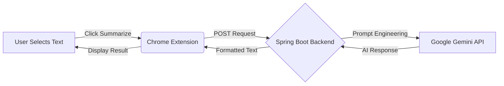

# 🧠 AI-Powered Web Summarizer


> **Research Faster, Not Harder.**  
> Instantly summarize any web content with the power of Generative AI, directly from your browser's side panel.

---

## 🚀 Overview

The **AI-Powered Web Summarizer** is a full-stack application designed to boost productivity by condensing vast amounts of information into concise, actionable insights. It combines a robust **Spring Boot** backend leveraging **Spring AI** and **Google Gemini** with a sleek, user-friendly **Chrome Extension**.

Whether you're a developer reading documentation, a student researching a topic, or just browsing the news, this tool helps you get to the core of the content in seconds.

## ✨ Key Features

*   **⚡ Instant Summarization**: Select any text on a webpage and generate a bullet-point summary with a single click.
*   **📝 Smart Research Notes**: Automatically save your summaries or write your own notes in a persistent side panel.
*   **🗑️ Note Management**: Easily save, view, and delete your research notes (with safety confirmations).
*   **🎨 Modern UI**: A beautiful, dark-themed interface designed for readability and focus.
*   **🔒 Privacy Focused**: Your data is processed securely and notes are stored locally in your browser.

## 🛠️ Tech Stack

### Backend 🔙
*   **Language**: Java 17
*   **Framework**: Spring Boot 3
*   **AI Integration**: Spring AI
*   **Model**: Google Gemini Pro API
*   **Build Tool**: Maven

### Frontend (Extension) 🎨
*   **Core**: HTML5, CSS3, Vanilla JavaScript
*   **Platform**: Chrome Extension API (Manifest V3)
*   **Styling**: Custom CSS with modern variables and flexbox layouts

## 🏗️ Architecture



## 🏁 Getting Started

Follow these steps to set up the project locally.

### Prerequisites
*   Java 17+ installed
*   Maven installed
*   Google Gemini API Key
*   Google Chrome (or Chromium-based browser)

### 1. Backend Setup
1.  **Clone the repository**:
    ```bash
    git clone https://github.com/yourusername/spring-ai-summarizer.git
    cd spring-ai-summarizer/summarizer
    ```
2.  **Configure API Key**:
    Open `src/main/resources/application.properties` and add your Gemini API key:
    ```properties
    gemini.api.key=YOUR_GEMINI_API_KEY
    gemini.api.url=https://generativelanguage.googleapis.com/v1beta/models/gemini-1.5-flash:generateContent?key=
    ```
3.  **Run the Application**:
    ```bash
    mvn spring-boot:run
    ```
    The backend will start on `http://localhost:8080`.

### 2. Extension Setup
1.  Open Google Chrome and navigate to `chrome://extensions/`.
2.  Enable **Developer mode** in the top right corner.
3.  Click **Load unpacked**.
4.  Select the `summarizer-extension` directory from the project folder.
5.  The **Summarizer** extension icon should appear in your browser toolbar.

## 📖 How to Use

1.  **Pin the Extension**: Pin the Summarizer extension to your toolbar for easy access.
2.  **Open Side Panel**: Click the extension icon to open the side panel.
3.  **Select Text**: Highlight any text on a webpage that you want to summarize.
4.  **Click Summarize**: Hit the "Summarize Selection" button in the side panel.
5.  **View Results**: The AI-generated summary will appear instantly.
6.  **Manage Notes**:
    *   **Save**: Type or paste content into the "Research Notes" area and click "Save".
    *   **Delete**: Click "Delete" to clear your notes (confirm the action in the popup).

## 🤝 Contributing

Contributions are welcome! If you have ideas for new features or improvements, feel free to fork the repo and submit a pull request.

1.  Fork the Project
2.  Create your Feature Branch (`git checkout -b feature/AmazingFeature`)
3.  Commit your Changes (`git commit -m 'Add some AmazingFeature'`)
4.  Push to the Branch (`git push origin feature/AmazingFeature`)
5.  Open a Pull Request

## 📄 License

Distributed under the MIT License. See `LICENSE` for more information.

---

<p align="center">
  Made with ❤️ by Manish
</p>